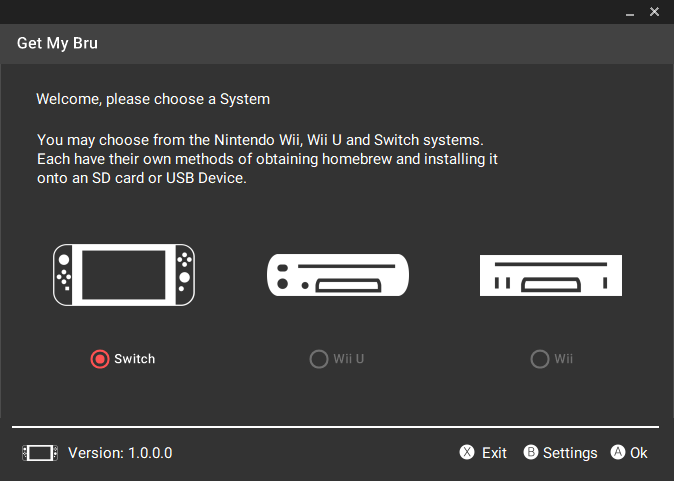
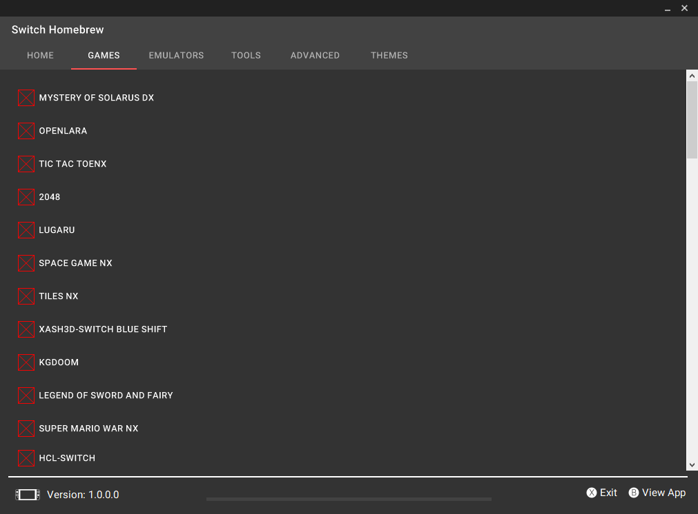

Latest build [here.](https://ci.appveyor.com/project/zoltx23/getmybru/branch/master/artifacts)

# GetMyBru - **WIP**
AIO Homebrew downloader for Wii, Wii U and Switch. 

Download necessary Wii, Wii U or Switch Homebrew all in one place. 
This application is written using C# and .NET 4.6.x. 

This Software is licensed under the GNU GPL v3 License Agreement. 
A copy of the License is included with the Source inside in the Repository.

# Screenshots 

# Credits 
* [4TU](https://fortheusers.org/#services)
* [WiiBrew](https://wiibrew.org/wiki/Main_Page)
* Google's Material Design Icon/s
* Uses Libget made by the team over at 4TU
* Qt design library
